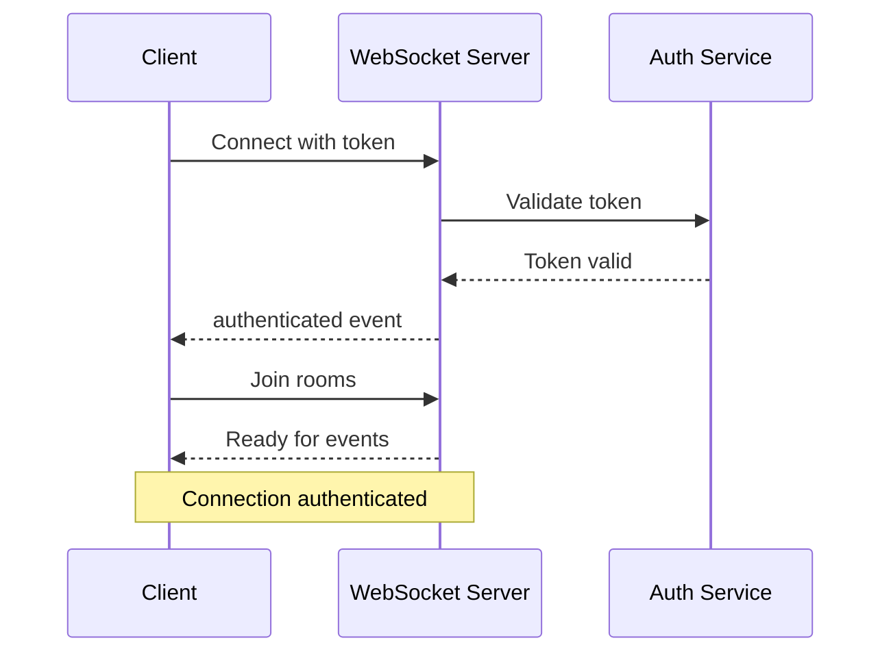

# Flamoral WebSocket API Documentation

## Table of Contents

- [Overview](#overview)
- [Connection Setup](#connection-setup)
- [Authentication](#authentication)
- [Event Types](#event-types)
- [Messaging Events](#messaging-events)
- [Presence Events](#presence-events)
- [Matching Events](#matching-events)
- [Notification Events](#notification-events)
- [Video Call Signaling](#video-call-signaling)
- [Error Handling](#error-handling)
- [Reconnection Strategy](#reconnection-strategy)
- [Best Practices](#best-practices)

---

## Overview

The Flamoral platform uses WebSocket connections for real-time features including messaging, presence, live notifications, and video call signaling. This enables instant updates without polling.

### WebSocket Server

| Environment | URL |
|------------|-----|
| Production | `wss://api.flamoral.com` |
| Staging | `wss://api-staging.flamoral.com` |
| Development | `ws://localhost:3000` |

### Technology

- **Protocol**: Socket.IO over WebSocket
- **Library**: Socket.IO v4.x
- **Namespace**: `/` (default)
- **Transport**: WebSocket (with fallback to long-polling)

---

## Connection Setup

### Client Installation

**JavaScript/TypeScript:**
```bash
npm install socket.io-client
```

**Swift (iOS):**
```bash
pod 'Socket.IO-Client-Swift'
```

**Kotlin (Android):**
```groovy
implementation 'io.socket:socket.io-client:2.1.0'
```

### Basic Connection

**JavaScript:**
```javascript
import { io } from 'socket.io-client';

const socket = io('https://api.flamoral.com', {
  auth: {
    token: accessToken,
    userId: currentUserId
  },
  transports: ['websocket', 'polling'],
  reconnection: true,
  reconnectionDelay: 1000,
  reconnectionAttempts: 5
});

// Connection successful
socket.on('connect', () => {
  console.log('Connected to Flamoral:', socket.id);
});

// Connection error
socket.on('connect_error', (error) => {
  console.error('Connection error:', error.message);
});

// Disconnected
socket.on('disconnect', (reason) => {
  console.log('Disconnected:', reason);
});
```

**Swift:**
```swift
import SocketIO

let manager = SocketManager(
    socketURL: URL(string: "https://api.flamoral.com")!,
    config: [
        .log(true),
        .compress,
        .reconnects(true),
        .reconnectAttempts(5),
        .reconnectWait(1)
    ]
)

let socket = manager.defaultSocket

socket.on(clientEvent: .connect) { data, ack in
    print("Connected to Flamoral")
    socket.emit("authenticate", [
        "token": accessToken,
        "userId": currentUserId
    ])
}

socket.on(clientEvent: .error) { data, ack in
    print("Connection error: \(data)")
}

socket.connect()
```

**Kotlin:**
```kotlin
import io.socket.client.IO
import io.socket.client.Socket

val opts = IO.Options().apply {
    auth = mapOf(
        "token" to accessToken,
        "userId" to currentUserId
    )
    reconnection = true
    reconnectionDelay = 1000
    reconnectionAttempts = 5
}

val socket = IO.socket("https://api.flamoral.com", opts)

socket.on(Socket.EVENT_CONNECT) {
    println("Connected to Flamoral: ${socket.id()}")
}

socket.on(Socket.EVENT_CONNECT_ERROR) { args ->
    println("Connection error: ${args[0]}")
}

socket.connect()
```

---

## Authentication

WebSocket connections must be authenticated before use.

### Authentication Methods

#### 1. Auth Header (Recommended)

Pass authentication in connection options:

```javascript
const socket = io('https://api.flamoral.com', {
  auth: {
    token: accessToken,    // JWT access token
    userId: currentUserId  // User ID
  }
});
```

#### 2. Post-Connection Authentication

Authenticate after connection:

```javascript
const socket = io('https://api.flamoral.com');

socket.on('connect', () => {
  socket.emit('authenticate', {
    token: accessToken,
    userId: currentUserId
  });
});

socket.on('authenticated', (data) => {
  console.log('Authenticated successfully:', data);
});

socket.on('unauthorized', (error) => {
  console.error('Authentication failed:', error);
  socket.disconnect();
});
```

### Authentication Flow



### Handling Token Expiration

Access tokens expire after 15 minutes. Handle token refresh:

```javascript
let socket;
let reconnectInterval;

function connectWebSocket(token) {
  if (socket) {
    socket.disconnect();
  }

  socket = io('https://api.flamoral.com', {
    auth: { token, userId: currentUserId }
  });

  socket.on('connect_error', async (error) => {
    if (error.message === 'jwt expired') {
      // Refresh token
      const newToken = await refreshAccessToken();
      connectWebSocket(newToken);
    }
  });

  return socket;
}

// Refresh token before expiration (every 14 minutes)
reconnectInterval = setInterval(async () => {
  const newToken = await refreshAccessToken();
  connectWebSocket(newToken);
}, 14 * 60 * 1000);
```

---

## Event Types

### Event Naming Convention

Events follow the pattern: `{domain}:{action}`

Examples:
- `message:new`
- `message:delivered`
- `presence:online`
- `match:new`
- `notification:new`

### Event Structure

All events follow this structure:

```typescript
interface WebSocketEvent {
  type: string;           // Event type
  data: any;              // Event data
  timestamp: string;      // ISO 8601 timestamp
  eventId?: string;       // Unique event ID (for tracking)
  userId?: string;        // User who triggered the event
}
```

---

## Messaging Events

### Listening for Messages

#### message:new

Emitted when a new message is received.

**Event Data:**
```typescript
interface NewMessageEvent {
  message: {
    id: string;
    conversationId: string;
    senderId: string;
    receiverId: string;
    content: string;
    type: 'text' | 'image' | 'gif' | 'voice' | 'video';
    status: 'sent' | 'delivered' | 'read';
    sentAt: string;
    metadata?: {
      mediaUrl?: string;
      thumbnailUrl?: string;
      duration?: number;
      replyTo?: string;
    };
  };
  sender: {
    id: string;
    firstName: string;
    photoUrl: string;
  };
}
```

**Example:**
```javascript
socket.on('message:new', (event) => {
  console.log('New message from:', event.sender.firstName);
  console.log('Message:', event.message.content);

  // Update UI
  addMessageToConversation(event.message);

  // Show notification if app is in background
  if (!isAppForeground()) {
    showNotification({
      title: event.sender.firstName,
      body: event.message.content,
      icon: event.sender.photoUrl
    });
  }

  // Mark as delivered
  socket.emit('message:delivered', {
    messageId: event.message.id,
    conversationId: event.message.conversationId
  });
});
```

#### message:delivered

Emitted when your message is delivered to recipient.

**Event Data:**
```typescript
interface MessageDeliveredEvent {
  messageId: string;
  conversationId: string;
  deliveredAt: string;
}
```

**Example:**
```javascript
socket.on('message:delivered', (event) => {
  // Update message status in UI
  updateMessageStatus(event.messageId, 'delivered');
});
```

#### message:read

Emitted when your message is read by recipient.

**Event Data:**
```typescript
interface MessageReadEvent {
  messageId: string;
  conversationId: string;
  readAt: string;
}
```

**Example:**
```javascript
socket.on('message:read', (event) => {
  // Update message status in UI
  updateMessageStatus(event.messageId, 'read');
});
```

#### message:deleted

Emitted when a message is deleted.

**Event Data:**
```typescript
interface MessageDeletedEvent {
  messageId: string;
  conversationId: string;
  deletedBy: string;
  deletedAt: string;
}
```

**Example:**
```javascript
socket.on('message:deleted', (event) => {
  // Remove message from UI
  removeMessageFromConversation(event.messageId);
});
```

### Sending Messages

#### message:send

Send a new message.

**Request:**
```typescript
interface SendMessageRequest {
  conversationId: string;
  receiverId: string;
  content: string;
  type: 'text' | 'image' | 'gif' | 'voice';
  metadata?: {
    mediaUrl?: string;
    replyTo?: string;
  };
}
```

**Example:**
```javascript
socket.emit('message:send', {
  conversationId: 'conv_abc123',
  receiverId: 'usr_def456',
  content: 'Hello! How are you?',
  type: 'text'
}, (response) => {
  if (response.success) {
    console.log('Message sent:', response.message);
    // Update UI with sent message
    addMessageToConversation(response.message);
  } else {
    console.error('Failed to send:', response.error);
    showError('Failed to send message. Please try again.');
  }
});
```

**Response:**
```typescript
interface SendMessageResponse {
  success: boolean;
  message?: Message;
  error?: string;
}
```

#### message:mark-read

Mark messages as read.

**Request:**
```typescript
interface MarkAsReadRequest {
  conversationId: string;
  messageIds: string[];
}
```

**Example:**
```javascript
// Mark all messages in conversation as read
socket.emit('message:mark-read', {
  conversationId: 'conv_abc123',
  messageIds: unreadMessageIds
});
```

### Typing Indicators

#### typing:start

Indicate that user is typing.

**Request:**
```javascript
socket.emit('typing:start', {
  conversationId: 'conv_abc123',
  receiverId: 'usr_def456'
});
```

**Event:**
```javascript
socket.on('typing:start', (event) => {
  // Show "X is typing..." indicator
  showTypingIndicator(event.userId, event.conversationId);
});
```

#### typing:stop

Indicate that user stopped typing.

**Request:**
```javascript
socket.emit('typing:stop', {
  conversationId: 'conv_abc123',
  receiverId: 'usr_def456'
});
```

**Event:**
```javascript
socket.on('typing:stop', (event) => {
  // Hide typing indicator
  hideTypingIndicator(event.userId, event.conversationId);
});
```

**Auto-stop Implementation:**
```javascript
let typingTimeout;

function handleTyping(conversationId, receiverId) {
  // Clear previous timeout
  clearTimeout(typingTimeout);

  // Emit typing start
  socket.emit('typing:start', { conversationId, receiverId });

  // Auto-stop after 3 seconds
  typingTimeout = setTimeout(() => {
    socket.emit('typing:stop', { conversationId, receiverId });
  }, 3000);
}

// Call on each keystroke
messageInput.addEventListener('input', () => {
  handleTyping(currentConversationId, currentReceiverId);
});
```

---

## Presence Events

Track online/offline status of users.

### presence:online

Emitted when a user comes online.

**Event Data:**
```typescript
interface PresenceOnlineEvent {
  userId: string;
  onlineAt: string;
  deviceType: 'ios' | 'android' | 'web';
}
```

**Example:**
```javascript
socket.on('presence:online', (event) => {
  // Update user's online status in UI
  updateUserPresence(event.userId, true);

  // Show notification for matched users
  if (isMatchedUser(event.userId)) {
    showToast(`${getUserName(event.userId)} is online`);
  }
});
```

### presence:offline

Emitted when a user goes offline.

**Event Data:**
```typescript
interface PresenceOfflineEvent {
  userId: string;
  offlineAt: string;
  lastActiveAt: string;
}
```

**Example:**
```javascript
socket.on('presence:offline', (event) => {
  // Update user's online status in UI
  updateUserPresence(event.userId, false);
  updateLastActive(event.userId, event.lastActiveAt);
});
```

### Subscribing to User Presence

```javascript
// Subscribe to presence updates for matched users
socket.emit('presence:subscribe', {
  userIds: matchedUserIds
});

// Unsubscribe when leaving matches screen
socket.emit('presence:unsubscribe', {
  userIds: matchedUserIds
});
```

### Automatic Presence Management

The server automatically manages your presence:

- **Online**: When connected to WebSocket
- **Offline**: 5 minutes after disconnection
- **Last Active**: Updated on each activity

**Client-side heartbeat:**
```javascript
// Send heartbeat every 30 seconds
setInterval(() => {
  if (socket.connected) {
    socket.emit('heartbeat');
  }
}, 30000);
```

---

## Matching Events

### match:new

Emitted when a new match is made.

**Event Data:**
```typescript
interface NewMatchEvent {
  match: {
    id: string;
    userId: string;
    matchedAt: string;
    expiresAt: string;
  };
  user: {
    id: string;
    firstName: string;
    age: number;
    photos: Photo[];
    bio: string;
  };
  conversationId: string;
}
```

**Example:**
```javascript
socket.on('match:new', (event) => {
  // Show match animation
  showMatchAnimation(event.user);

  // Play sound effect
  playSound('match');

  // Vibrate device
  if (navigator.vibrate) {
    navigator.vibrate([200, 100, 200]);
  }

  // Add to matches list
  addMatch(event.match, event.user);

  // Show match modal with option to message
  showMatchModal({
    match: event.match,
    user: event.user,
    onMessage: () => {
      navigateToConversation(event.conversationId);
    }
  });
});
```

### match:expired

Emitted when a match expires (24 hours without messaging).

**Event Data:**
```typescript
interface MatchExpiredEvent {
  matchId: string;
  userId: string;
  expiredAt: string;
}
```

**Example:**
```javascript
socket.on('match:expired', (event) => {
  // Remove from matches list
  removeMatch(event.matchId);

  // Show notification
  showNotification({
    title: 'Match Expired',
    body: 'Your match with this person has expired'
  });
});
```

### match:unmatched

Emitted when either user unmatches.

**Event Data:**
```typescript
interface UnmatchedEvent {
  matchId: string;
  userId: string;
  unmatchedAt: string;
}
```

**Example:**
```javascript
socket.on('match:unmatched', (event) => {
  // Remove match and conversation
  removeMatch(event.matchId);
  removeConversation(event.matchId);

  // Show notification
  showToast('You have been unmatched');
});
```

---

## Notification Events

### notification:new

Emitted when a new notification is created.

**Event Data:**
```typescript
interface NewNotificationEvent {
  notification: {
    id: string;
    type: 'like' | 'super_like' | 'match' | 'message' | 'profile_view';
    title: string;
    body: string;
    data: any;
    read: boolean;
    createdAt: string;
  };
}
```

**Example:**
```javascript
socket.on('notification:new', (event) => {
  const { notification } = event;

  // Add to notification list
  addNotification(notification);

  // Update badge count
  incrementBadgeCount();

  // Show in-app notification
  if (isAppForeground()) {
    showInAppNotification({
      title: notification.title,
      body: notification.body,
      onClick: () => {
        handleNotificationClick(notification);
      }
    });
  }

  // Play sound for certain types
  if (['match', 'message'].includes(notification.type)) {
    playNotificationSound();
  }
});
```

### Notification Types

| Type | Description | Example |
|------|-------------|---------|
| `like` | Someone liked your profile | "Jane liked your profile" |
| `super_like` | Someone super liked you | "John sent you a Super Like!" |
| `match` | New match created | "You matched with Sarah!" |
| `message` | New message received | "Alex sent you a message" |
| `profile_view` | Someone viewed your profile | "Your profile was viewed 5 times today" |
| `boost_active` | Your boost is now active | "Your profile boost is live!" |
| `subscription` | Subscription update | "Your Premium subscription has been renewed" |

---

## Video Call Signaling

WebSocket is used for WebRTC signaling during video calls.

### call:offer

Initiate a video call.

**Request:**
```javascript
socket.emit('call:offer', {
  callId: 'call_abc123',
  receiverId: 'usr_def456',
  offer: rtcPeerConnection.localDescription
});
```

**Event:**
```javascript
socket.on('call:offer', async (event) => {
  // Show incoming call UI
  showIncomingCall({
    callId: event.callId,
    caller: event.caller,
    onAccept: async () => {
      // Accept call and send answer
      await acceptCall(event.callId, event.offer);
    },
    onReject: () => {
      // Reject call
      socket.emit('call:reject', {
        callId: event.callId
      });
    }
  });
});
```

### call:answer

Answer a call.

**Request:**
```javascript
socket.emit('call:answer', {
  callId: 'call_abc123',
  answer: rtcPeerConnection.localDescription
});
```

**Event:**
```javascript
socket.on('call:answer', async (event) => {
  // Set remote description
  await rtcPeerConnection.setRemoteDescription(
    new RTCSessionDescription(event.answer)
  );
});
```

### call:ice-candidate

Exchange ICE candidates for WebRTC connection.

**Request:**
```javascript
rtcPeerConnection.onicecandidate = (event) => {
  if (event.candidate) {
    socket.emit('call:ice-candidate', {
      callId: currentCallId,
      candidate: event.candidate
    });
  }
};
```

**Event:**
```javascript
socket.on('call:ice-candidate', async (event) => {
  await rtcPeerConnection.addIceCandidate(
    new RTCIceCandidate(event.candidate)
  );
});
```

### call:end

End a call.

**Request:**
```javascript
socket.emit('call:end', {
  callId: 'call_abc123'
});
```

**Event:**
```javascript
socket.on('call:end', (event) => {
  // Close RTC connection
  rtcPeerConnection.close();

  // Hide call UI
  hideCallUI();

  // Show call ended message
  showToast('Call ended');
});
```

### Complete Video Call Example

```javascript
class VideoCallManager {
  constructor(socket) {
    this.socket = socket;
    this.peerConnection = null;
    this.currentCallId = null;

    this.setupSocketListeners();
  }

  setupSocketListeners() {
    this.socket.on('call:offer', this.handleOffer.bind(this));
    this.socket.on('call:answer', this.handleAnswer.bind(this));
    this.socket.on('call:ice-candidate', this.handleIceCandidate.bind(this));
    this.socket.on('call:end', this.handleCallEnd.bind(this));
  }

  async initiateCall(receiverId) {
    this.currentCallId = `call_${Date.now()}`;

    // Create peer connection
    this.peerConnection = new RTCPeerConnection({
      iceServers: [
        { urls: 'stun:stun.l.google.com:19302' },
        {
          urls: 'turn:turn.flamoral.com:3478',
          username: 'flamoral',
          credential: 'turnpassword'
        }
      ]
    });

    // Get local media
    const localStream = await navigator.mediaDevices.getUserMedia({
      video: true,
      audio: true
    });

    // Add tracks to peer connection
    localStream.getTracks().forEach(track => {
      this.peerConnection.addTrack(track, localStream);
    });

    // Handle ICE candidates
    this.peerConnection.onicecandidate = (event) => {
      if (event.candidate) {
        this.socket.emit('call:ice-candidate', {
          callId: this.currentCallId,
          candidate: event.candidate
        });
      }
    };

    // Handle remote stream
    this.peerConnection.ontrack = (event) => {
      const remoteVideo = document.getElementById('remoteVideo');
      remoteVideo.srcObject = event.streams[0];
    };

    // Create and send offer
    const offer = await this.peerConnection.createOffer();
    await this.peerConnection.setLocalDescription(offer);

    this.socket.emit('call:offer', {
      callId: this.currentCallId,
      receiverId,
      offer: this.peerConnection.localDescription
    });
  }

  async handleOffer(event) {
    this.currentCallId = event.callId;

    // Show incoming call UI
    const accepted = await showIncomingCallDialog(event.caller);

    if (!accepted) {
      this.socket.emit('call:reject', { callId: event.callId });
      return;
    }

    // Create peer connection
    this.peerConnection = new RTCPeerConnection(/* config */);

    // Get local media and add tracks
    const localStream = await navigator.mediaDevices.getUserMedia({
      video: true,
      audio: true
    });

    localStream.getTracks().forEach(track => {
      this.peerConnection.addTrack(track, localStream);
    });

    // Set remote description
    await this.peerConnection.setRemoteDescription(
      new RTCSessionDescription(event.offer)
    );

    // Create and send answer
    const answer = await this.peerConnection.createAnswer();
    await this.peerConnection.setLocalDescription(answer);

    this.socket.emit('call:answer', {
      callId: event.callId,
      answer: this.peerConnection.localDescription
    });
  }

  async handleAnswer(event) {
    await this.peerConnection.setRemoteDescription(
      new RTCSessionDescription(event.answer)
    );
  }

  async handleIceCandidate(event) {
    await this.peerConnection.addIceCandidate(
      new RTCIceCandidate(event.candidate)
    );
  }

  handleCallEnd(event) {
    if (this.peerConnection) {
      this.peerConnection.close();
      this.peerConnection = null;
    }
    this.currentCallId = null;

    hideCallUI();
    showToast('Call ended');
  }

  endCall() {
    if (this.currentCallId) {
      this.socket.emit('call:end', {
        callId: this.currentCallId
      });

      this.handleCallEnd({});
    }
  }
}
```

---

## Error Handling

Handle WebSocket errors gracefully.

### Error Event

```javascript
socket.on('error', (error) => {
  console.error('Socket error:', error);

  switch (error.code) {
    case 'AUTH_FAILED':
      // Invalid token - refresh and reconnect
      refreshTokenAndReconnect();
      break;

    case 'RATE_LIMITED':
      // Too many events - slow down
      showError('Please slow down');
      break;

    case 'INVALID_EVENT':
      // Sent invalid event data
      console.error('Invalid event data:', error.details);
      break;

    case 'SERVER_ERROR':
      // Server error - will auto-reconnect
      showError('Connection issue. Reconnecting...');
      break;

    default:
      showError('An error occurred');
  }
});
```

### Event-specific Errors

When emitting events with callbacks, handle errors:

```javascript
socket.emit('message:send', messageData, (response) => {
  if (!response.success) {
    console.error('Failed to send message:', response.error);

    // Handle specific errors
    switch (response.error) {
      case 'CONVERSATION_NOT_FOUND':
        showError('Conversation no longer exists');
        break;

      case 'USER_BLOCKED':
        showError('Cannot send message to blocked user');
        break;

      case 'RATE_LIMITED':
        showError('You are sending messages too quickly');
        break;

      case 'INSUFFICIENT_PERMISSIONS':
        showError('You need Premium to send messages');
        break;

      default:
        showError('Failed to send message');
    }

    // Retry logic
    if (shouldRetry(response.error)) {
      retryMessage(messageData);
    }
  }
});
```

---

## Reconnection Strategy

Implement robust reconnection logic.

### Automatic Reconnection

Socket.IO handles reconnection automatically:

```javascript
const socket = io('https://api.flamoral.com', {
  reconnection: true,
  reconnectionDelay: 1000,      // Initial delay
  reconnectionDelayMax: 5000,   // Max delay
  reconnectionAttempts: 10      // Max attempts
});

socket.on('reconnect_attempt', (attemptNumber) => {
  console.log('Reconnection attempt:', attemptNumber);
  showReconnectingIndicator();
});

socket.on('reconnect', (attemptNumber) => {
  console.log('Reconnected after', attemptNumber, 'attempts');
  hideReconnectingIndicator();

  // Re-authenticate if needed
  reAuthenticate();

  // Re-subscribe to presence
  reSubscribeToPresence();

  // Sync missed messages
  syncMissedMessages();
});

socket.on('reconnect_failed', () => {
  console.error('Reconnection failed');
  showError('Unable to connect. Please check your internet connection.');

  // Give up and show offline mode
  enableOfflineMode();
});
```

### Manual Reconnection

Implement manual reconnection for specific cases:

```javascript
async function reconnectWithNewToken() {
  // Get new access token
  const newToken = await refreshAccessToken();

  // Disconnect current socket
  socket.disconnect();

  // Update auth and reconnect
  socket.auth = { token: newToken, userId: currentUserId };
  socket.connect();
}

// Reconnect on token refresh
eventBus.on('token:refreshed', (newToken) => {
  reconnectWithNewToken();
});
```

### Exponential Backoff

For custom reconnection logic:

```javascript
class ReconnectionManager {
  constructor() {
    this.attempts = 0;
    this.maxAttempts = 10;
    this.baseDelay = 1000;
    this.maxDelay = 30000;
  }

  async reconnect() {
    if (this.attempts >= this.maxAttempts) {
      console.error('Max reconnection attempts reached');
      this.onMaxAttemptsReached();
      return;
    }

    this.attempts++;

    // Calculate delay with exponential backoff
    const delay = Math.min(
      this.baseDelay * Math.pow(2, this.attempts),
      this.maxDelay
    );

    console.log(`Reconnecting in ${delay}ms (attempt ${this.attempts})`);

    await new Promise(resolve => setTimeout(resolve, delay));

    try {
      socket.connect();
    } catch (error) {
      console.error('Reconnection failed:', error);
      this.reconnect();
    }
  }

  reset() {
    this.attempts = 0;
  }

  onMaxAttemptsReached() {
    showError('Unable to connect. Please try again later.');
    enableOfflineMode();
  }
}

const reconnectionManager = new ReconnectionManager();

socket.on('disconnect', () => {
  reconnectionManager.reconnect();
});

socket.on('connect', () => {
  reconnectionManager.reset();
});
```

---

## Best Practices

### 1. Connection Management

```javascript
// Single socket instance for the app
let socketInstance;

export function getSocket() {
  if (!socketInstance) {
    socketInstance = io('https://api.flamoral.com', {
      auth: {
        token: getAccessToken(),
        userId: getCurrentUserId()
      },
      autoConnect: false
    });

    setupSocketListeners(socketInstance);
  }

  return socketInstance;
}

// Connect when user logs in
export function connectSocket() {
  const socket = getSocket();
  if (!socket.connected) {
    socket.connect();
  }
}

// Disconnect when user logs out
export function disconnectSocket() {
  const socket = getSocket();
  if (socket.connected) {
    socket.disconnect();
  }
}
```

### 2. Event Listener Management

```javascript
// Use one-time listeners for responses
socket.once('message:sent', (response) => {
  // Handle response
});

// Clean up listeners when component unmounts
useEffect(() => {
  const handleNewMessage = (event) => {
    // Handle message
  };

  socket.on('message:new', handleNewMessage);

  return () => {
    socket.off('message:new', handleNewMessage);
  };
}, []);
```

### 3. Offline Queue

```javascript
class MessageQueue {
  constructor(socket) {
    this.socket = socket;
    this.queue = [];

    socket.on('connect', () => this.processQueue());
  }

  send(message) {
    if (this.socket.connected) {
      this.sendMessage(message);
    } else {
      this.queue.push(message);
    }
  }

  sendMessage(message) {
    this.socket.emit('message:send', message, (response) => {
      if (!response.success) {
        // Re-queue on failure
        this.queue.push(message);
      }
    });
  }

  processQueue() {
    while (this.queue.length > 0) {
      const message = this.queue.shift();
      this.sendMessage(message);
    }
  }
}
```

### 4. Heartbeat and Connection Health

```javascript
class ConnectionHealthMonitor {
  constructor(socket) {
    this.socket = socket;
    this.lastPong = Date.now();
    this.pingInterval = null;

    this.startMonitoring();
  }

  startMonitoring() {
    // Send ping every 25 seconds
    this.pingInterval = setInterval(() => {
      const start = Date.now();

      this.socket.emit('ping', (response) => {
        const latency = Date.now() - start;
        this.lastPong = Date.now();

        this.updateConnectionQuality(latency);
      });
    }, 25000);

    // Check for connection timeout
    setInterval(() => {
      const timeSinceLastPong = Date.now() - this.lastPong;

      if (timeSinceLastPong > 60000) {
        console.warn('Connection appears to be dead');
        this.socket.disconnect();
        this.socket.connect();
      }
    }, 30000);
  }

  updateConnectionQuality(latency) {
    let quality;
    if (latency < 100) quality = 'excellent';
    else if (latency < 300) quality = 'good';
    else if (latency < 1000) quality = 'fair';
    else quality = 'poor';

    // Update UI indicator
    updateConnectionIndicator(quality);
  }

  stop() {
    if (this.pingInterval) {
      clearInterval(this.pingInterval);
    }
  }
}
```

### 5. Event Batching

```javascript
class EventBatcher {
  constructor(socket, eventName, batchSize = 10, timeoutMs = 1000) {
    this.socket = socket;
    this.eventName = eventName;
    this.batchSize = batchSize;
    this.timeoutMs = timeoutMs;
    this.batch = [];
    this.timeout = null;
  }

  add(data) {
    this.batch.push(data);

    if (this.batch.length >= this.batchSize) {
      this.flush();
    } else if (!this.timeout) {
      this.timeout = setTimeout(() => this.flush(), this.timeoutMs);
    }
  }

  flush() {
    if (this.batch.length === 0) return;

    this.socket.emit(this.eventName, {
      events: this.batch
    });

    this.batch = [];

    if (this.timeout) {
      clearTimeout(this.timeout);
      this.timeout = null;
    }
  }
}

// Usage: batch analytics events
const analyticsBatcher = new EventBatcher(socket, 'analytics:batch');

// Track events
analyticsBatcher.add({ type: 'profile_view', userId: 'usr_123' });
analyticsBatcher.add({ type: 'swipe', direction: 'like' });
// Events will be sent in batch
```

---

This completes the WebSocket API documentation. For more information about specific features, see:

- [REST API Reference](./API_REFERENCE_COMPLETE.md)
- [Video Calling Integration](./VIDEO_CALLING_INTEGRATION.md)
- [Error Codes Reference](./ERROR_CODES.md)
