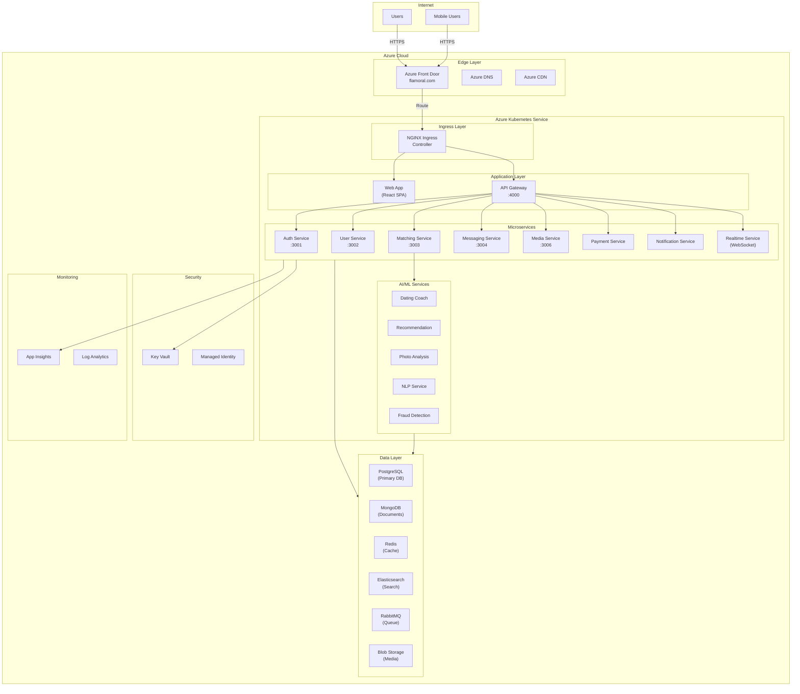
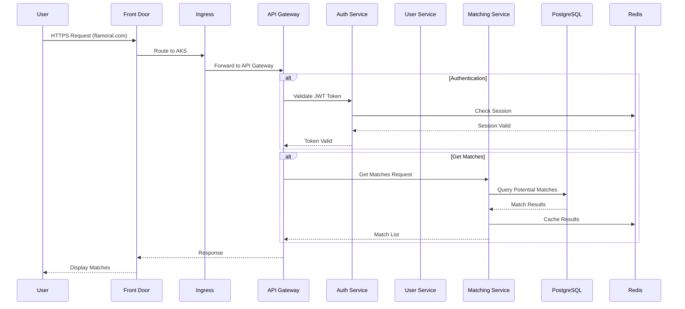
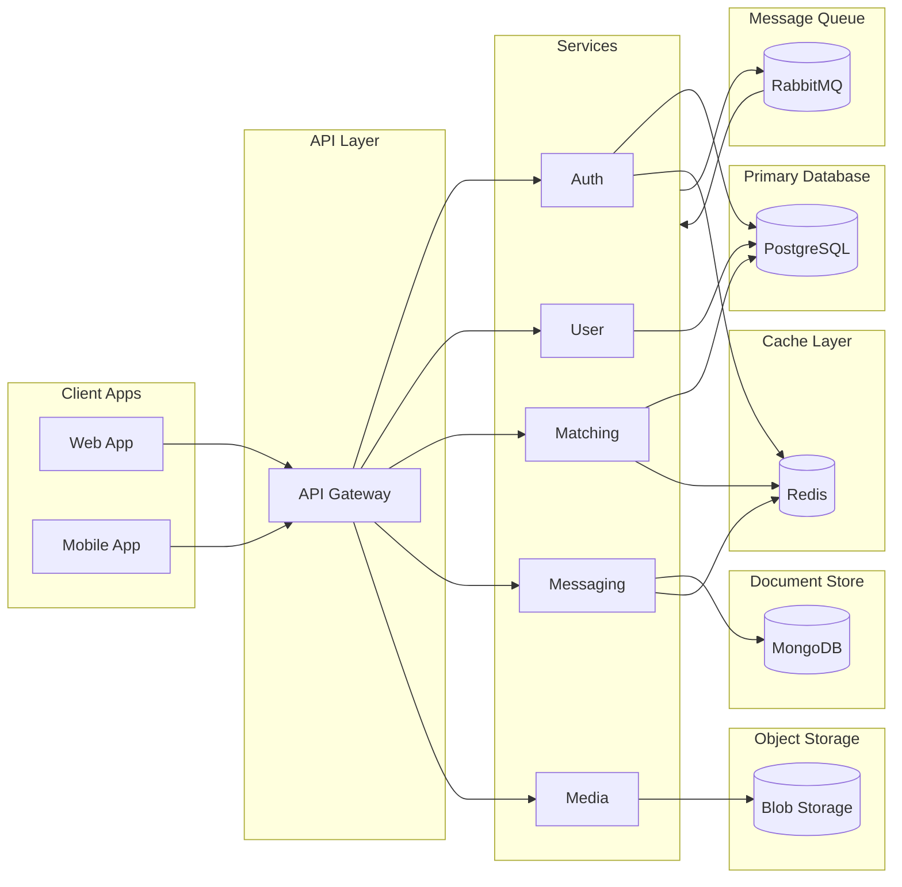
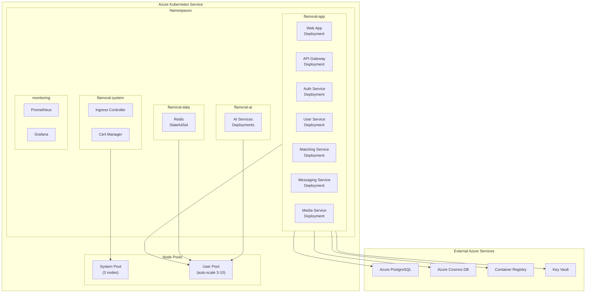
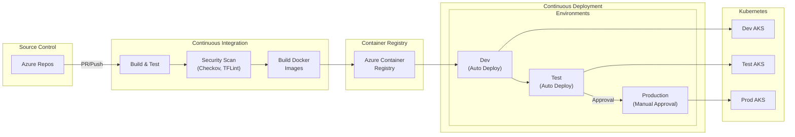
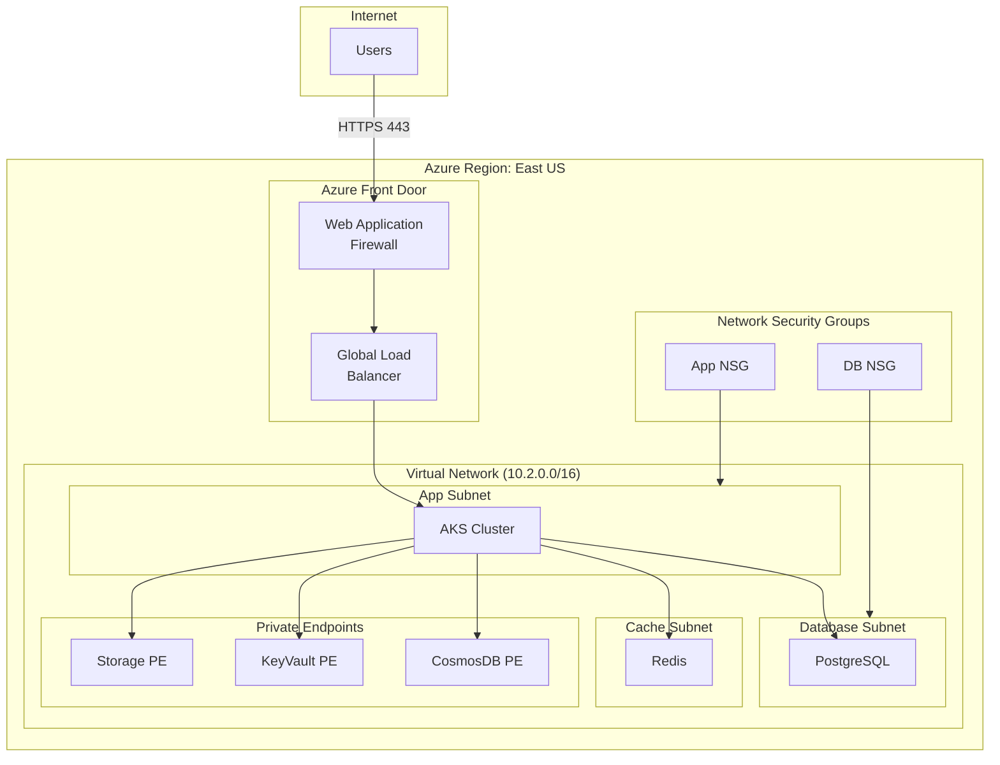
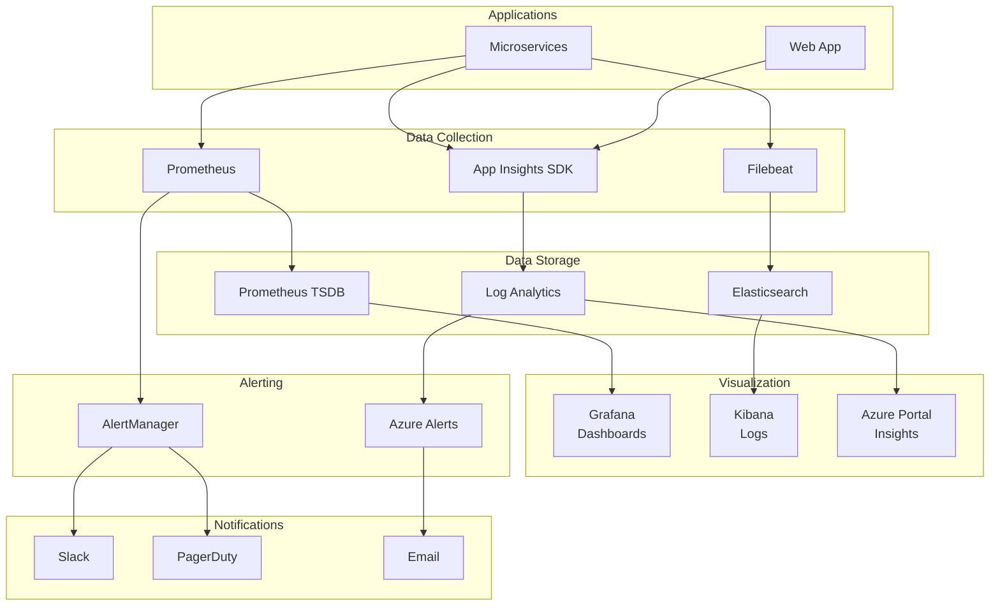
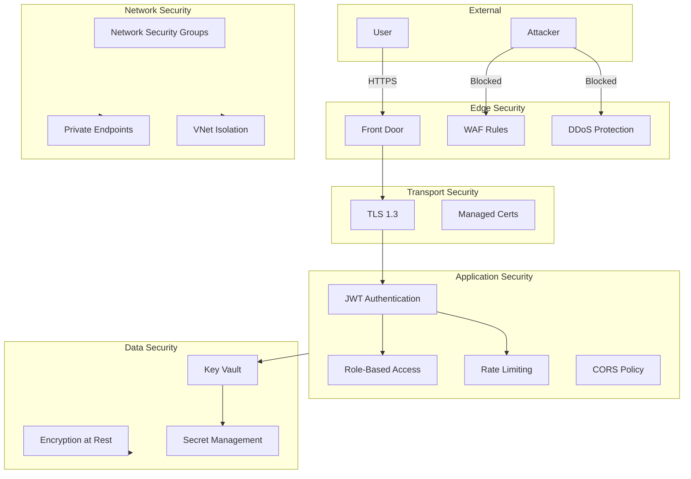

# Flamoral Platform - High-Level Architecture Diagrams

## 1. System Overview

## 2. Request Flow Architecture

## 3. Data Flow Architecture

## 4. Kubernetes Deployment Architecture

## 5. CI/CD Pipeline Architecture

## 6. Network Architecture

## 7. Monitoring Architecture

## 8. Security Architecture

---

## Diagram Legend

| Symbol | Meaning |
|--------|---------|
| Rectangle | Service or Component |
| Cylinder | Database or Storage |
| Diamond | Decision Point |
| Arrow | Data/Request Flow |
| Subgraph | Logical Grouping |

## Related Documentation

- [ARCHITECTURE_OVERVIEW.md](../ARCHITECTURE_OVERVIEW.md) - Detailed architecture documentation
- [DEPLOYMENT_K8S_GUIDE.md](../DEPLOYMENT_K8S_GUIDE.md) - Kubernetes deployment guide
- [CI_CD_PIPELINES.md](../CI_CD_PIPELINES.md) - CI/CD pipeline documentation
- [DNS_AND_DOMAIN_SETUP.md](../DNS_AND_DOMAIN_SETUP.md) - Domain configuration guide
